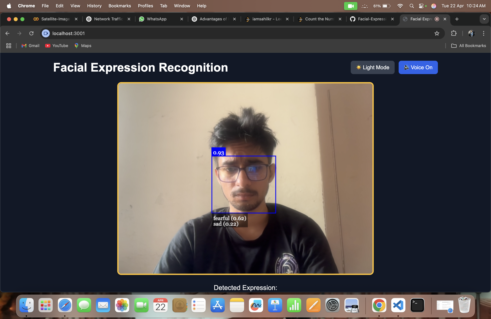
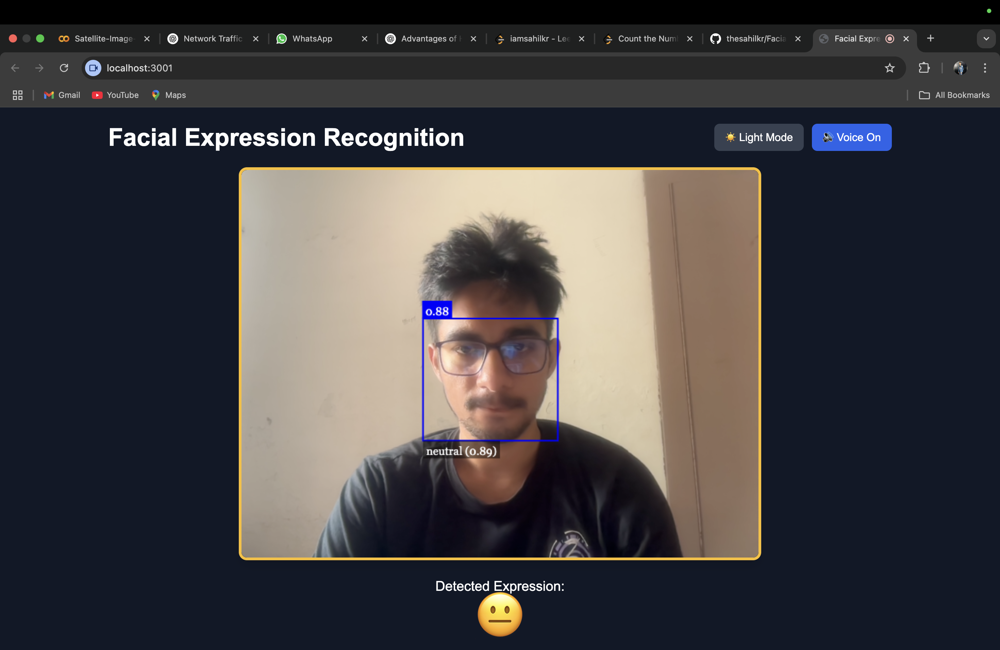
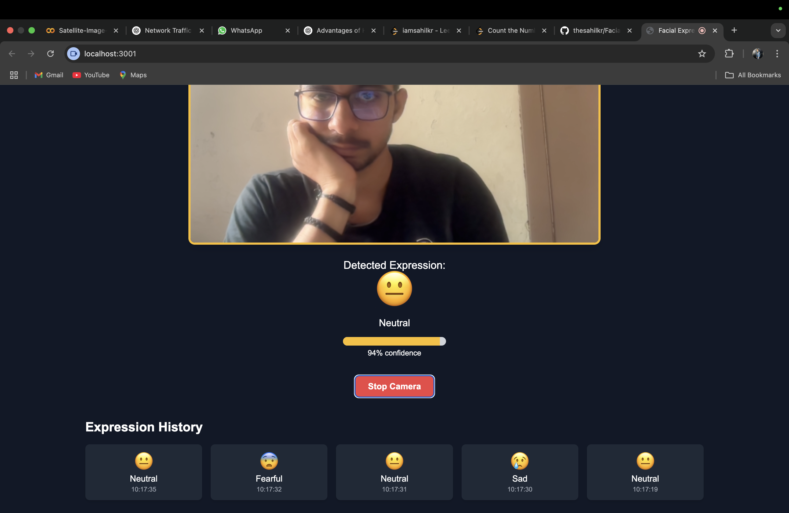
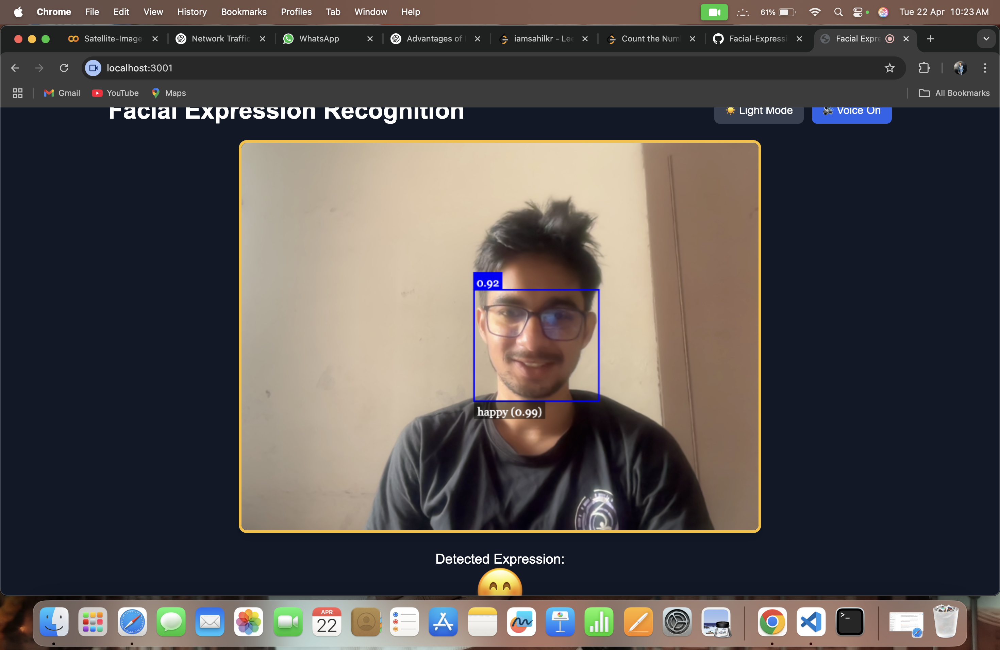
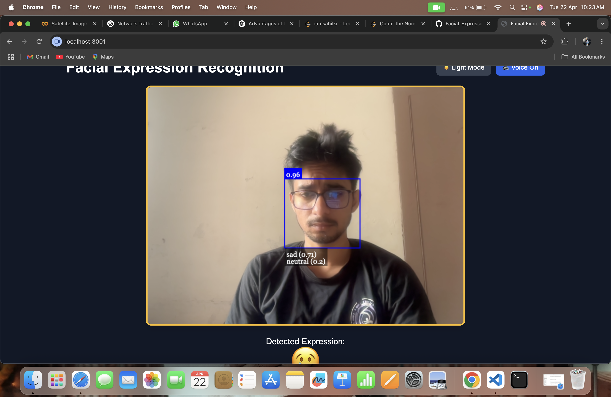
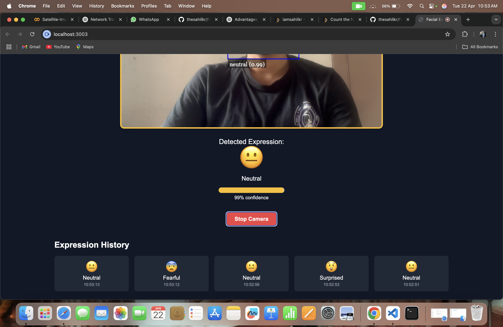
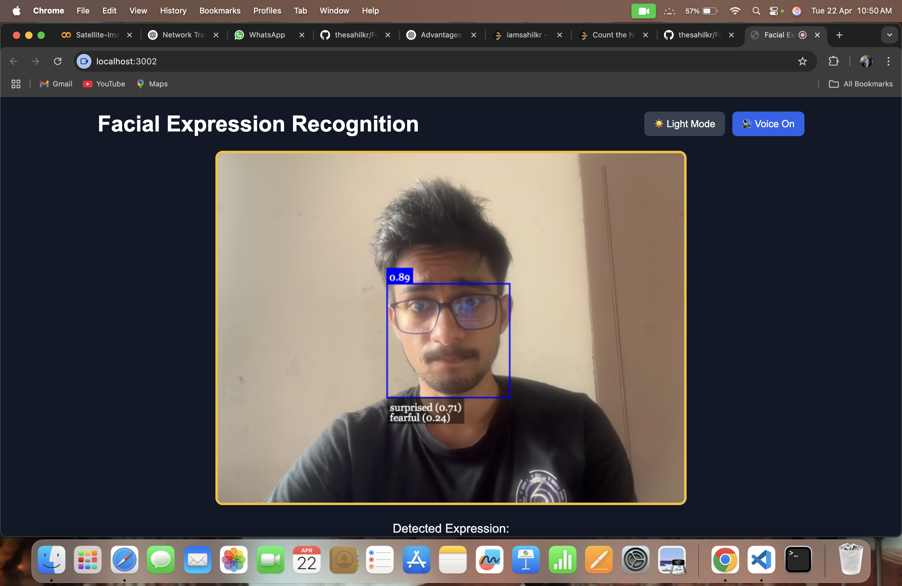
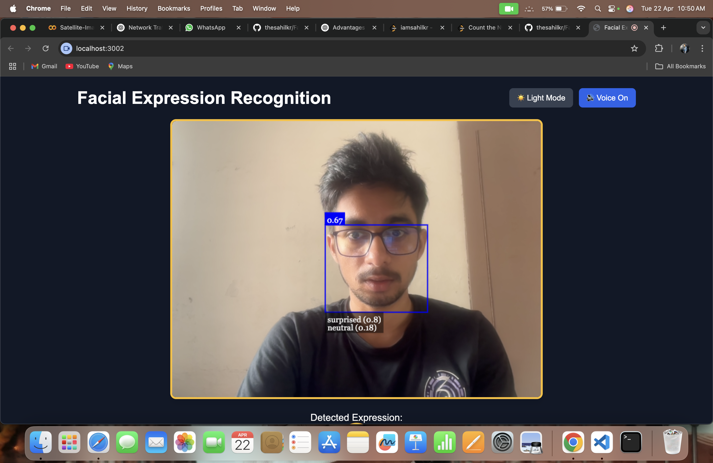
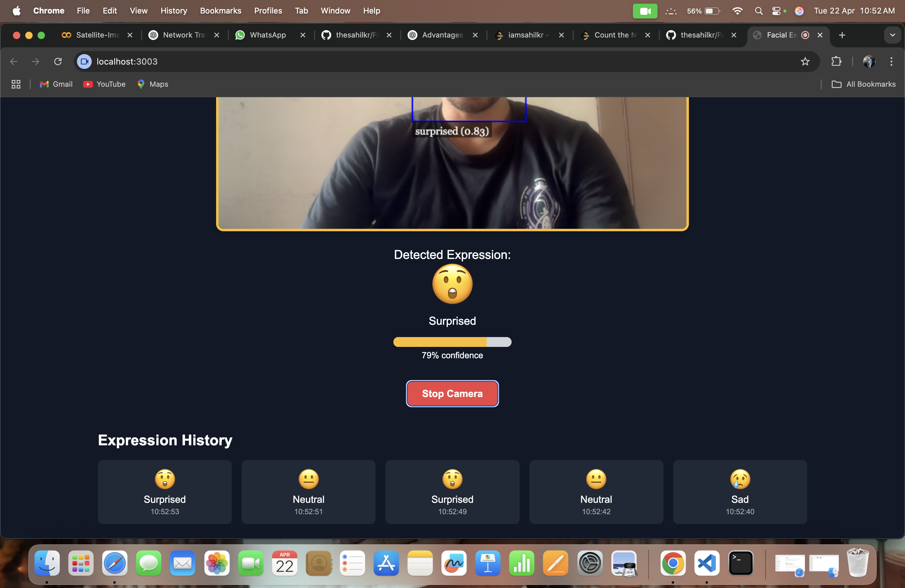

# 😊 Facial Expression Recognition App

A React-based facial expression recognition web app that detects and displays your emotions in real-time using your webcam. It shows matching emojis, visualizes confidence, maintains expression history, and can even speak the detected emotion aloud.

## 🖼️ Demo Screenshots

### Expression Detection


### Emoji Feedback


### Voice Toggle & Themes


### Confidence Meter


### Expression History


### Light Mode UI


### Dark Mode UI


### Start Camera Button


### Stop Camera State



## 🚀 Features

- 🎥 Real-time face and expression detection using `face-api.js`
- 😃 Emoji representation of your facial expressions
- 📈 Animated confidence progress bar
- 🔊 Toggleable voice feedback using SpeechSynthesis API
- 🌗 Light / Dark mode switch
- 🧠 Expression history with timestamps
- 🎛️ Start/Stop camera control

## 🧰 Tech Stack

- [React](https://reactjs.org/)
- [face-api.js](https://github.com/justadudewhohacks/face-api.js)
- [Tailwind CSS](https://tailwindcss.com/)
- [Web Speech API (SpeechSynthesis)](https://developer.mozilla.org/en-US/docs/Web/API/SpeechSynthesis)

## 📦 Setup & Installation

### 1. Clone the repository

```bash
git clone https://github.com/yourusername/facial-expression-app.git
cd facial-expression-app
